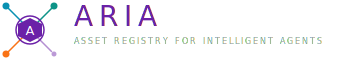

  

  <strong>Asset Registry for Intelligent Agents</strong> 
  A reference architecture for classifying, governing, and composing AI assets at enterprise scale.

  <a href="https://github.com/aria-fx/aria">Reference Implementation</a>
  ·
  <a href="https://github.com/aria-fx/aria/tree/main/tutorial">Tutorial</a>
  ·
  <a href="https://github.com/aria-fx/aria/tree/main/docs/architecture">Architecture Docs</a>

---

ARIA defines a practical operating model for AI assets built on three foundational layers, with additional operational layers for distribution, AI FinOps, and consumption:

- Metamodel: [OASF](https://schema.oasf.outshift.com/) entities, relationships, and lifecycle states.
- Marketplace: GitHub + OCI patterns for publishing and composing reusable assets.
- Governance: Microsoft Purview integration for sensitivity, lineage, and policy enforcement.

## Why ARIA

Organizations are building agents faster than they can govern them. ARIA provides:

- A shared taxonomy for agents, skills, domains, modules, and records.
- A discoverable marketplace model with versioning and provenance.
- Governance controls that travel with the asset lifecycle.
- A path from architecture principles to working implementations.

## What You Will Find Here

- Reference architecture and conference-ready documentation.
- Infrastructure modules for GitHub marketplace and Azure governance.
- A sample C# agent demonstrating [OASF](https://schema.oasf.outshift.com/) governance middleware.
- An ARIA CLI prototype for search, inspect, audit, and install workflows.

## Core Repositories

- [aria](https://github.com/aria-fx/aria): Architecture, docs, tutorial, Terraform, sample agent, and CLI prototype.
- [aria-skills](https://github.com/aria-fx/aria-skills): Skills catalog, orchestrator configs, and reusable skill packages.
- [aria-gateway](https://github.com/aria-fx/aria-gateway): API and UI gateway components for ARIA distribution and access.
- [.github](https://github.com/aria-fx/.github): Organization profile, standards, and shared workflows.

## Brand

  

The ARIA mark encodes the framework model:

- Hexagonal hub: canonical [OASF](https://schema.oasf.outshift.com/) record.
- Outer ring: registry boundary.
- Four satellite nodes: primary relationship patterns.
- Three colored lines: metamodel, marketplace, and governance layers.

## Getting Started

1. Start with the [ARIA tutorial](https://github.com/aria-fx/aria/tree/main/tutorial).
2. Review the [reference architecture](https://github.com/aria-fx/aria/blob/main/docs/architecture/aria-reference-architecture.md).
3. Explore [sample agent implementation](https://github.com/aria-fx/aria/tree/main/src/sample-agent).
4. Use Terraform modules to bootstrap your own marketplace and governance baseline.

## License

MIT
